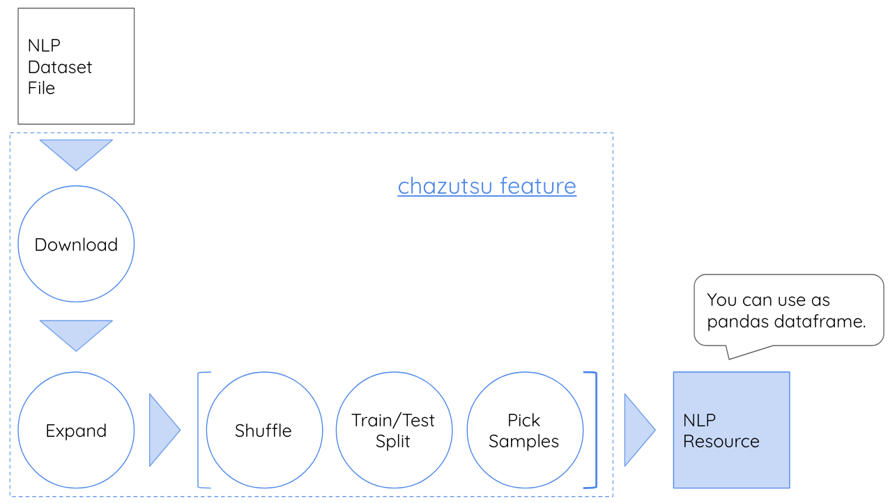
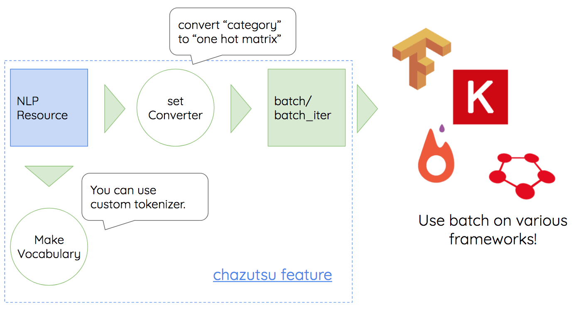

# chazutsu


*[photo from Kaikado, traditional Japanese chazutsu maker](http://www.kaikado.jp/english/goods/design.html)*

Do you have trouble with finding & getting the  dataset for natural language processing?  

For example

* exploring the dataset by googling
* arrange the data for the model training 
* tokenize the data then make vocabulary, convert to ids... :confounded:

Now **chazutsu** helps you from above problems.


# How it works



**chazutsu** offers you not only downloading the dataest, but also shuffle, split, pick samples from it.

```py
>>> import chazutsu
>>> r = chazutsu.datasets.MovieReview.polarity(shuffle=True, test_size=0.3, sample_count=100).download()
Make directory for downloading the file to /your/current/directory
Begin downloading the Moview Review Data dataset from http://www.cs.cornell.edu/people/pabo/movie-review-data/review_polarity.tar.gz.
The dataset file is saved to /your/current/directory/data/moview_review_data/review_polarity.tar.gz
...
File is splited to review_polarity_train.txt & review_polarity_test.txt. Each records are 1400 & 600 (test_size=30.00%).
...
Make review_polarity_samples.txt by picking 100 records from original file.
...
Done all process! Make below files at /your/current/directory/data/moview_review_data
 review_polarity_test.txt
 review_polarity_train.txt

>>> r.train_data().head(5)
   polarity                                             review
0         0  plot : a little boy born in east germany ( nam...
1         0  when i arrived in paris in june , 1992 , i was...
2         0   idle hands  is distasteful , crass and deriva...
3         0  phaedra cinema , the distributor of such never...
4         0  one-sided " doom and gloom " documentary about...
```

* You can access the dataset from [pandas](http://pandas.pydata.org/) DataFrame (Of course you can read the file from its path)
* You can use `sample_count` parameter to watch the data without opening the huge size of file
* The supported dataset and its detail are described at [here](https://github.com/chakki-works/chazutsu/tree/master/chazutsu/datasets)

When dealing with the text data, tokenization and word-to-id process is fundamental process. **chazutsu** supports it.



```py
>>> import chazutsu
>>> r = chazutsu.datasets.MovieReview.subjectivity().download()
>>> r_idx = r.to_indexed().make_vocab(min_word_count=3)
>>> r_idx.train_data().head(3)
   subjectivity                                             review
0             0  [1840, 7, 516, 26, 566, 4, 25, 6997, 64, 8, 7,...
1             0  [11, 1, 44, 1028, 20, 0, 7309, 2924, 3, 725, 8...
2             1  [34, 436, 1, 918, 2, 7291, 45, 235, 0, 129, 58...
>>> r_idx.train_data()["review"].map(r_idx.ids_to_words).head(3)
0    [cho, s, fans, are, sure, to, be, entertained,...
1    [with, a, story, inspired, by, the, tumultuous...
2    [they, lead, a, boring, and, unattractive, lif...
Name: review, dtype: object
```

* You can use `to_indexed` to make indexed resource
* You can set various parameters and custome tokenizer to execute `make_vocab`.

## Additional Feature

### Use on Jupyter

You can use chazutsu on [Jupyter Notebook](http://jupyter.org/).  


Before you execute chazutsu on Jupyter, you have to enable widget extention by below command.

```
jupyter nbextension enable --py --sys-prefix widgetsnbextension
```

# Install

```
pip install chazutsu
```

# Supported Dataset

* Sentiment Analysis
  * [Movie Review Data](https://github.com/chakki-works/chazutsu/tree/master/chazutsu/datasets#movie-review-data)
  * [Customer Review Datasets](https://github.com/chakki-works/chazutsu/tree/master/chazutsu/datasets#customer-review-datasets)
  * [Large Movie Review Dataset(IMDB)](https://github.com/chakki-works/chazutsu/tree/master/chazutsu/datasets#large-movie-review-datasetimdb)
* Textual entailment
  * [The Multi-Genre Natural Language Inference (MultiNLI)]()
* Text classification
  * [20 Newsgroups](https://github.com/chakki-works/chazutsu/tree/master/chazutsu/datasets#20-newsgroups)
  * [Reuters News Courpus (RCV1-v2)](https://github.com/chakki-works/chazutsu/tree/master/chazutsu/datasets#reuters-news-courpus-rcv1-v2)
* Language Modeling
  * [Penn Tree Bank](https://github.com/chakki-works/chazutsu/tree/master/chazutsu/datasets#penn-tree-bank)
  * [WikiText-2](https://github.com/chakki-works/chazutsu/tree/master/chazutsu/datasets#wikitext-2)
  * [WikiText-103](https://github.com/chakki-works/chazutsu/tree/master/chazutsu/datasets#wikitext-103)
  * [text8](https://github.com/chakki-works/chazutsu/tree/master/chazutsu/datasets#text8)
